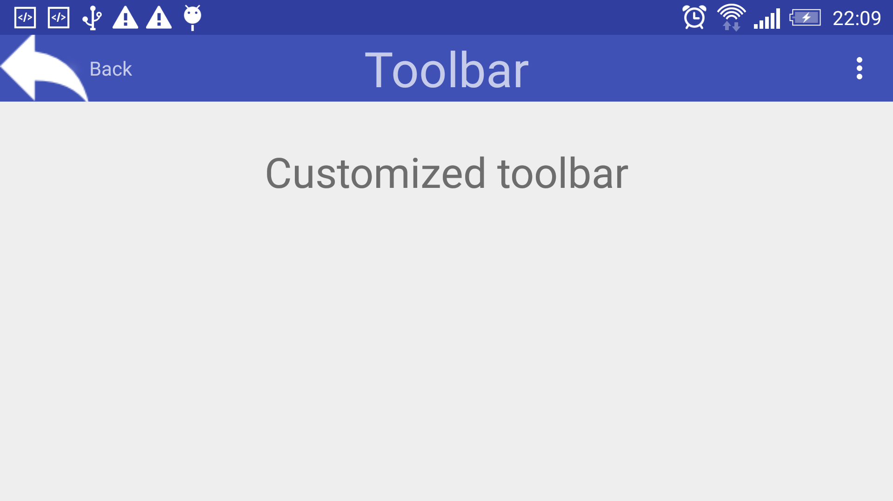
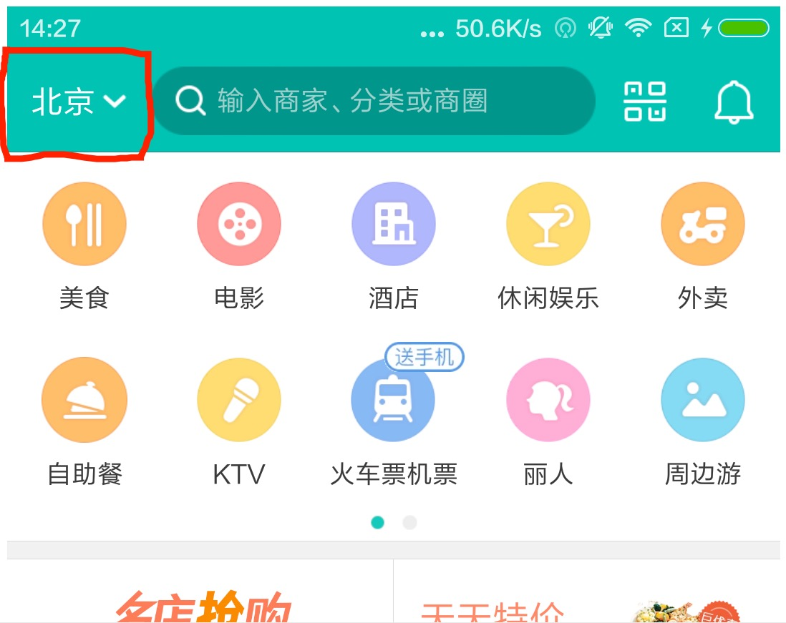
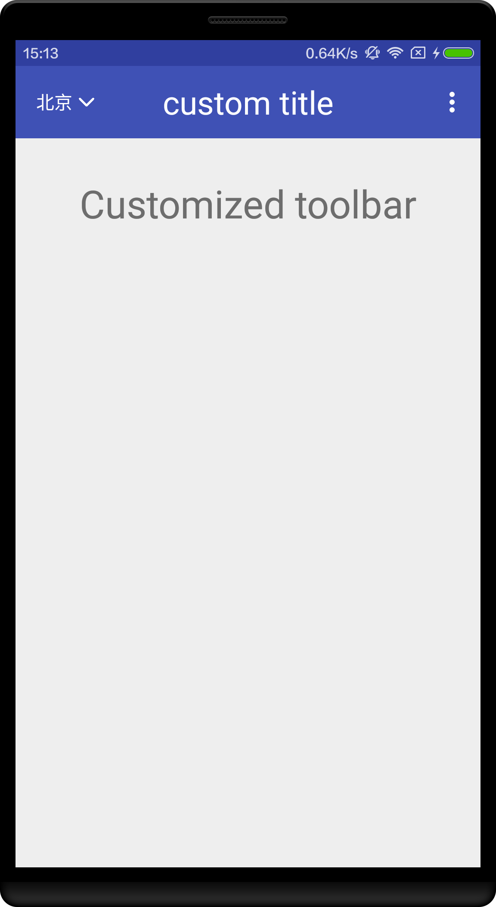

# Custom Android Toolbar

</img>

Boilerplate project with customized toolbar that supports:

- Custom back image
- Custom back text
- Default title centered horizontally and easy editable.

###Setting up the toolbar in new project.
 
1. Copy the xml layout of the toolbar.
2. Include the toolbar.xml into the activity xml.
3. Let the Activity implement methods from MainActivity.java (Best to make Superclass).
    - setToolbar() initializes the toolbar, call this method in onCreate()
    - setBackText() 
    - setTitle()
    
    
    
    
    
    
#Custom NavigationTitle into Toolbar
sometime we want custom NavigationTitle into Toolbar,so we can use this ,you can see below picture
        

#this is meituan splash picture
</img>
        

#this is my custom picture
</img>my_custom.png
        

  